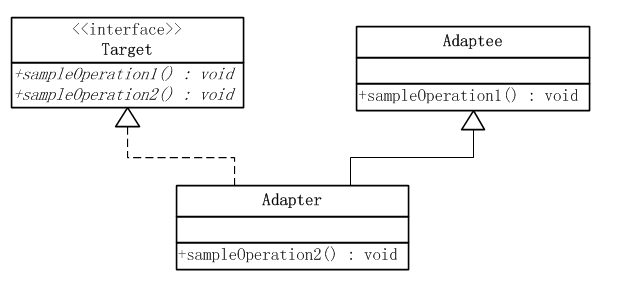
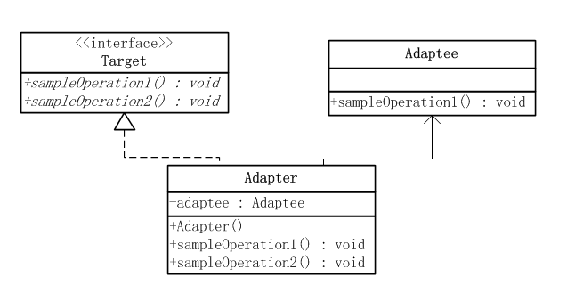

# Android设计模式源码解析之适配器(Adapter)模式

> 本文为 [Android 设计模式源码解析](https://github.com/simple-android-framework-exchange/android_design_patterns_analysis) 中 适配器模式 分析
> Android系统版本： 2.3
> 分析者：[Mr.Simple](https://github.com/bboyfeiyu)，分析状态：完成，校对者：[Mr.Simple](https://github.com/bboyfeiyu)，校对状态：完成

## 1. 模式介绍

### 1.1模式的定义

适配器模式把一个类的接口变换成客户端所期待的另一种接口，从而使原本因接口不匹配而无法在一起工作的两个类能够在一起工作。

### 1.2使用场景

用电源接口做例子，笔记本电脑的电源一般都是接受5V的电压，但是我们生活中的电线电压一般都是220V的输出。这个时候就出现了不匹配的状况，在软件开发中我们称之为接口不兼容，此时就需要适配器来进行一个接口转换。在软件开发中有一句话正好体现了这点：任何问题都可以加一个中间层来解决。这个层我们可以理解为这里的Adapter层，通过这层来进行一个接口转换就达到了兼容的目的。            

## 2. UML类图

适配器模式也分两种，即类适配器模式、对象适配器模式，结构图如图1、图2。





如图所示，类适配器是通过实现Target接口以及继承Adaptee类来实现接口转换，而对象适配器模式则是通过实现Target接口和代理Adaptee的某个方法来实现。结构上略有不同。           

### 2.1角色介绍

*   目标(Target)角色：这就是所期待得到的接口。注意：由于这里讨论的是类适配器模式，因此目标不可以是类。
*   源(Adapee)角色：现在需要适配的接口。
*   适配器(Adaper)角色：适配器类是本模式的核心。适配器把源接口转换成目标接口。显然，这一角色不可以是接口，而必须是具体类。      


## 3. 模式的简单实现

在上述电源接口这个示例中，5V电压就是Target接口，220v电压就是Adaptee类，而将电压从220V转换到5V就是Adapter。

### 3.1 类适配器模式

```java
/**
 * Target角色
 */
public interface FiveVolt {
    public int getVolt5();
}

/**
 * Adaptee角色,需要被转换的对象
 */
public class Volt220 {
    public int getVolt220() {
        return 220;
    }
}

// adapter角色
public class ClassAdapter extends Volt220 implements FiveVolt {

    @Override
    public int getVolt5() {
        return 5;
    }

}
```
Target角色给出了需要的目标接口，而Adaptee类则是需要被转换的对象。Adapter则是将Volt220转换成Target的接口。对应的是Target的目标是要获取5V的输出电压，而Adaptee即正常输出电压是220V，此时我们就需要电源适配器类将220V的电压转换为5V电压，解决接口不兼容的问题。     

```java
public class Test {
    public static void main(String[] args) {
        ClassAdapter adapter = new ClassAdapter();
        System.out.println("输出电压 : " + adapter.getVolt5());
    }
}
```

### 3.2 对象适配器模式

与类的适配器模式一样，对象的适配器模式把被适配的类的API转换成为目标类的API，与类的适配器模式不同的是，对象的适配器模式不是使用继承关系连接到Adaptee类，而是使用代理关系连接到Adaptee类
　　
从图2可以看出，Adaptee类 ( Volt220 ) 并没有getVolt5()方法，而客户端则期待这个方法。为使客户端能够使用Adaptee类，需要提供一个包装类Adapter。这个包装类包装了一个Adaptee的实例，从而此包装类能够把Adaptee的API与Target类的API衔接起来。Adapter与Adaptee是委派关系，这决定了适配器模式是对象的。

示例代码如下 :

```java
/**
 * Target角色
 */
public interface FiveVolt {
    public int getVolt5();
}

/**
 * Adaptee角色,需要被转换的对象
 */
public class Volt220 {
    public int getVolt220() {
        return 220;
    }
}

// 对象适配器模式
public class ObjectAdapter implements FiveVolt {

    Volt220 mVolt220;

    public ObjectAdapter(Volt220 adaptee) {
        mVolt220 = adaptee;
    }

    public int getVolt220() {
        return mVolt220.getVolt220();
    }

    @Override
    public int getVolt5() {
        return 5;
    }

}
```
注意，这里为了节省代码，我们并没有遵循一些面向对象的基本原则。       

使用示例 :    

```java
public class Test {
    public static void main(String[] args) {
        ObjectAdapter adapter = new ObjectAdapter(new Volt220());
        System.out.println("输出电压 : " + adapter.getVolt5());
    }
}
```

### 3.3 类适配器和对象适配器的权衡

- 类适配器使用对象继承的方式，是静态的定义方式；而对象适配器使用对象组合的方式，是动态组合的方式。

- 对于类适配器，由于适配器直接继承了Adaptee，使得适配器不能和Adaptee的子类一起工作，因为继承是静态的关系，当适配器继承了Adaptee后，就不可能再去处理Adaptee的子类了。对于对象适配器，一个适配器可以把多种不同的源适配到同一个目标。换言之，同一个适配器可以把源类和它的子类都适配到目标接口。因为对象适配器采用的是对象组合的关系，只要对象类型正确，是不是子类都无所谓。

- 对于类适配器，适配器可以重定义Adaptee的部分行为，相当于子类覆盖父类的部分实现方法。对于对象适配器，要重定义Adaptee的行为比较困难，这种情况下，需要定义Adaptee的子类来实现重定义，然后让适配器组合子类。虽然重定义Adaptee的行为比较困难，但是想要增加一些新的行为则方便的很，而且新增加的行为可同时适用于所有的源。

- 对于类适配器，仅仅引入了一个对象，并不需要额外的引用来间接得到Adaptee。对于对象适配器，需要额外的引用来间接得到Adaptee。

建议尽量使用对象适配器的实现方式，多用合成/聚合、少用继承。当然，具体问题具体分析，根据需要来选用实现方式，最适合的才是最好的。
　　

## 4. Android ListView中的Adapter模式
在开发过程中,ListView的Adapter是我们最为常见的类型之一。一般的用法大致如下:

```java
// 代码省略
 ListView myListView = (ListView)findViewById(listview_id);
 // 设置适配器
 myListView.setAdapter(new MyAdapter(context, myDatas));

// 适配器
public class MyAdapter extends BaseAdapter{

        private LayoutInflater mInflater;
        List<String> mDatas ;

        public MyAdapter(Context context, List<String> datas){
            this.mInflater = LayoutInflater.from(context);
            mDatas = datas ;
        }
        @Override
        public int getCount() {
            return mDatas.size();
        }

        @Override
        public String getItem(int pos) {
            return mDatas.get(pos);
        }

        @Override
        public long getItemId(int pos) {
            return pos;
        }

 		// 解析、设置、缓存convertView以及相关内容
        @Override
        public View getView(int position, View convertView, ViewGroup parent) {
            ViewHolder holder = null;
            // Item View的复用
            if (convertView == null) {
                holder = new ViewHolder();  
                convertView = mInflater.inflate(R.layout.my_listview_item, null);
              	// 获取title
                holder.title = (TextView)convertView.findViewById(R.id.title);
                convertView.setTag(holder);
            } else {
                holder = (ViewHolder)convertView.getTag();
            }
            holder.title.setText(mDatas.get(position));
            return convertView;
        }

    }
```
这看起来似乎还挺麻烦的，看到这里我们不禁要问，ListView为什么要使用Adapter模式呢？
我们知道，作为最重要的View，ListView需要能够显示各式各样的视图，每个人需要的显示效果各不相同，显示的数据类型、数量等也千变万化。那么如何隔离这种变化尤为重要。     

Android的做法是增加一个Adapter层来应对变化，将ListView需要的接口抽象到Adapter对象中，这样只要用户实现了Adapter的接口，ListView就可以按照用户设定的显示效果、数量、数据来显示特定的Item View
通过代理数据集来告知ListView数据的个数( getCount函数 )以及每个数据的类型( getItem函数 )，最重要的是要解决Item View的输出。Item View千变万化，但终究它都是View类型，Adapter统一将Item View输出为View ( getView函数 )，这样就很好的应对了Item View的可变性

那么ListView是如何通过Adapter模式 ( 不止Adapter模式 )来运作的呢 ？我们一起来看一看。   
ListView继承自AbsListView，Adapter定义在AbsListView中，我们看一看这个类

```java
public abstract class AbsListView extends AdapterView<ListAdapter> implements TextWatcher,
        ViewTreeObserver.OnGlobalLayoutListener, Filter.FilterListener,
        ViewTreeObserver.OnTouchModeChangeListener,
        RemoteViewsAdapter.RemoteAdapterConnectionCallback {

    ListAdapter mAdapter ;

    // 关联到Window时调用的函数
    @Override
    protected void onAttachedToWindow() {
        super.onAttachedToWindow();
        // 代码省略
		// 给适配器注册一个观察者,该模式下一篇介绍。
        if (mAdapter != null && mDataSetObserver == null) {
            mDataSetObserver = new AdapterDataSetObserver();
            mAdapter.registerDataSetObserver(mDataSetObserver);

            // Data may have changed while we were detached. Refresh.
            mDataChanged = true;
            mOldItemCount = mItemCount
            // 获取Item的数量,调用的是mAdapter的getCount方法
            mItemCount = mAdapter.getCount();
        }
        mIsAttached = true;
    }

  /**
     * 子类需要覆写layoutChildren()函数来布局child view,也就是Item View
     */
    @Override
    protected void onLayout(boolean changed, int l, int t, int r, int b) {
        super.onLayout(changed, l, t, r, b);
        mInLayout = true;
        if (changed) {
            int childCount = getChildCount();
            for (int i = 0; i < childCount; i++) {
                getChildAt(i).forceLayout();
            }
            mRecycler.markChildrenDirty();
        }

        if (mFastScroller != null && mItemCount != mOldItemCount) {
            mFastScroller.onItemCountChanged(mOldItemCount, mItemCount);
        }
		// 布局Child View
        layoutChildren();
        mInLayout = false;

        mOverscrollMax = (b - t) / OVERSCROLL_LIMIT_DIVISOR;
    }

	// 获取一个Item View
	View obtainView(int position, boolean[] isScrap) {
        isScrap[0] = false;
        View scrapView;
		// 从缓存的Item View中获取,ListView的复用机制就在这里
        scrapView = mRecycler.getScrapView(position);

        View child;
        if (scrapView != null) {
            // 代码省略
            child = mAdapter.getView(position, scrapView, this);
            // 代码省略
        } else {
            child = mAdapter.getView(position, null, this);
            // 代码省略
        }

        return child;
    }
    }
```
AbsListView定义了集合视图的框架，比如Adapter模式的应用、复用Item View的逻辑、布局Item View的逻辑等。子类只需要覆写特定的方法即可实现集合视图的功能，例如ListView。

ListView中的相关方法。    

```java
    @Override
    protected void layoutChildren() {
        // 代码省略

        try {
            super.layoutChildren();
            invalidate();
			// 代码省略
			// 根据布局模式来布局Item View
            switch (mLayoutMode) {
            case LAYOUT_SET_SELECTION:
                if (newSel != null) {
                    sel = fillFromSelection(newSel.getTop(), childrenTop, childrenBottom);
                } else {
                    sel = fillFromMiddle(childrenTop, childrenBottom);
                }
                break;
            case LAYOUT_SYNC:
                sel = fillSpecific(mSyncPosition, mSpecificTop);
                break;
            case LAYOUT_FORCE_BOTTOM:
                sel = fillUp(mItemCount - 1, childrenBottom);
                adjustViewsUpOrDown();
                break;
            case LAYOUT_FORCE_TOP:
                mFirstPosition = 0;
                sel = fillFromTop(childrenTop);
                adjustViewsUpOrDown();
                break;
            case LAYOUT_SPECIFIC:
                sel = fillSpecific(reconcileSelectedPosition(), mSpecificTop);
                break;
            case LAYOUT_MOVE_SELECTION:
                sel = moveSelection(oldSel, newSel, delta, childrenTop, childrenBottom);
                break;
            default:
                // 代码省略
                break;
            }

    }

    // 从上到下填充Item View  [ 只是其中一种填充方式 ]
    private View fillDown(int pos, int nextTop) {
        View selectedView = null;

        int end = (mBottom - mTop);
        if ((mGroupFlags & CLIP_TO_PADDING_MASK) == CLIP_TO_PADDING_MASK) {
            end -= mListPadding.bottom;
        }

        while (nextTop < end && pos < mItemCount) {
            // is this the selected item?
            boolean selected = pos == mSelectedPosition;
            View child = makeAndAddView(pos, nextTop, true, mListPadding.left, selected);

            nextTop = child.getBottom() + mDividerHeight;
            if (selected) {
                selectedView = child;
            }
            pos++;
        }

        return selectedView;
    }

    // 添加Item View
    private View makeAndAddView(int position, int y, boolean flow, int childrenLeft,
            boolean selected) {
        View child;

		// 代码省略
        // Make a new view for this position, or convert an unused view if possible
        child = obtainView(position, mIsScrap);

        // This needs to be positioned and measured
        setupChild(child, position, y, flow, childrenLeft, selected, mIsScrap[0]);

        return child;
    }

```
ListView覆写了AbsListView中的layoutChilden函数，在该函数中根据布局模式来布局Item View。Item View的个数、样式都通过Adapter对应的方法来获取，获取个数、Item View之后，将这些Item View布局到ListView对应的坐标上，再加上Item View的复用机制，整个ListView就基本运转起来了。     

当然这里的Adapter并不是经典的适配器模式，但是却是对象适配器模式的优秀示例，也很好的体现了面向对象的一些基本原则。这里的Target角色和Adapter角色融合在一起，Adapter中的方法就是目标方法；而Adaptee角色就是ListView的数据集与Item View，Adapter代理数据集，从而获取到数据集的个数、元素。     

通过增加Adapter一层来将Item View的操作抽象起来，ListView等集合视图通过Adapter对象获得Item的个数、数据元素、Item View等，从而达到适配各种数据、各种Item视图的效果。因为Item View和数据类型千变万化，Android的架构师们将这些变化的部分交给用户来处理，通过getCount、getItem、getView等几个方法抽象出来，也就是将Item View的构造过程交给用户来处理，灵活地运用了适配器模式，达到了无限适配、拥抱变化的目的。       

## 5. 杂谈
### 优点

- 更好的复用性：系统需要使用现有的类，而此类的接口不符合系统的需要。那么通过适配器模式就可以让这些功能得到更好的复用。

- 更好的扩展性：在实现适配器功能的时候，可以调用自己开发的功能，从而自然地扩展系统的功能。

### 缺点
* 过多的使用适配器，会让系统非常零乱，不易整体进行把握。比如，明明看到调用的是A接口，其实内部被适配成了B接口的实现，一个系统如果太多出现这种情况，无异于一场灾难。因此如果不是很有必要，可以不使用适配器，而是直接对系统进行重构。
