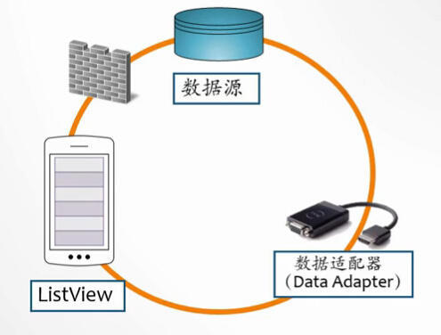
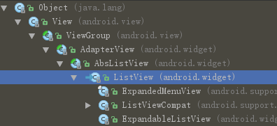
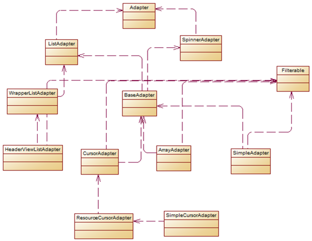
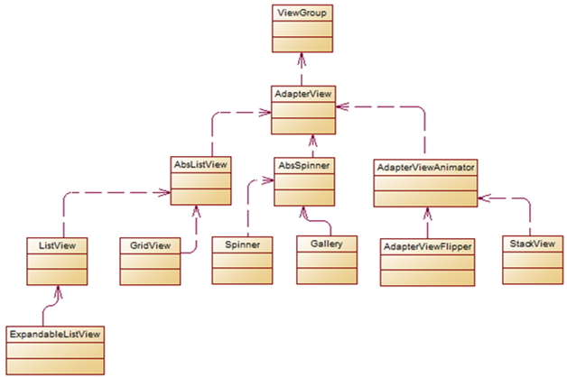

## 1. 概述
适配器模式将某个类的接口转换成客户端期望的另一个接口表示，目的是消除由于接口不匹配所造成的类的兼容性问题。主要分为三类：类的适配器模式、对象的适配器模式、接口的适配器模式。在Android中充分利用了适配器来实现view和数据的联系

## 2. 角色介绍
- Target接口（目标角色）：5v电压
- Adaptee（源角色，需要适配的接口）：220v电压
- Adapter（适配器，把源接口转换成目标接口）：把220v电压转变成5v

## 3. 经典案例

ListView，GridView，RecyclerView，BroadcastReceiver，Loader，事件总线

## 4. 案例分析

### 4.1 类的适配器模式

```java
public class Source {
        public void method1() {
            System.out.println("this is original method!");
        }
    }


    public interface Targetable {
        /* 与原类中的方法相同*/
        public void method1();

        /* 新类的方法*/
        public void method2();
    }

    public class Adapter extends Source implements Targetable {
        @Override
        public void method2() {
            System.out.println("this is the targetable method!");
        }
    }

    public class AdapterTest {
        public static void main(String[] args) {
            Targetable target = new Adapter();
            target.method1();
            target.method2();
        }
    }
```
### 4.2 对象的适配器模式

基本思路和类的适配器模式相同，只是将Adapter 类作修改，这次不继承Source 类，而是持有Source 类的实例，以达到解决兼容性的问题

```java
public class Wrapper implements Targetable {
        private Source source;

        public Wrapper(Source source) {
            super();
            this.source = source;
        }

        @Override
        public void method2() {
            System.out.println("this is the targetable method!");
        }

        @Override
        public void method1() {
            source.method1();
        }
    }


    public class AdapterTest {
        public static void main(String[] args) {
            Source source = new Source();
            Targetable target = new Wrapper(source);
            target.method1();
            target.method2();
        }
    }
```
### 4.3 接口的适配器模式

接口的适配器是这样的：有时我们写的一个接口中有多个抽象方法，当我们写该接口的实现类时，必须实现该接口的所有方法，这明显有时比较浪费，因为并不是所有的方法都是我们需要的，有时只需要某一些，此处为了解决这个问题，我们引入了接口的适配器模式，借助于一个抽象类，该抽象类实现了该接口，实现了所有的方法，而我们不和原始的接口打交道，只和该抽象类取得联系，所以我们写一个类，继承该抽象类，重写我们需要的方法就行。

### 4.4 ListView的适配器模式

在开发过程中，ListView的Adapter是我们最为常见的类型之一，一般的用法大致如下

```java
// 代码省略
ListView myListView = (ListView)findViewById(listview_id);
// 设置适配器
myListView.setAdapter(new MyAdapter(context, myDatas));

// 适配器
public class MyAdapter extends BaseAdapter {

    private LayoutInflater mInflater;
    List<String> mDatas ;

    public MyAdapter(Context context, List<String> datas){
        this.mInflater = LayoutInflater.from(context);
        mDatas = datas ;
    }
    @Override
    public int getCount() {
        return mDatas.size();
    }

    @Override
    public String getItem(int pos) {
        return mDatas.get(pos);
    }

    @Override
    public long getItemId(int pos) {
        return pos;
    }

    // 解析、设置、缓存convertView以及相关内容
    @Override
    public View getView(int position, View convertView, ViewGroup parent) {
        ViewHolder holder = null;
        // Item View的复用
        if (convertView == null) {
            holder = new ViewHolder();
            convertView = mInflater.inflate(R.layout.my_listview_item, null);
            // 获取title
            holder.title = (TextView)convertView.findViewById(R.id.title);
            convertView.setTag(holder);
        } else {
            holder = (ViewHolder)convertView.getTag();
        }
        holder.title.setText(mDatas.get(position));
        return convertView;
    }

}
```
这看起来似乎还挺麻烦的，看到这里我们不禁要问，ListView为什么要使用Adapter模式呢？

我们知道，作为最重要的View，ListView需要能够显示各式各样的视图，每个人需要的显示效果各不相同，显示的数据类型、数量等也千变万化。那么如何隔离这种变化尤为重要。

Android的做法是增加一个Adapter层来应对变化，将ListView需要的接口抽象到Adapter对象中，这样只要用户实现了Adapter的接口，ListView就可以按照用户设定的显示效果、数量、数据来显示特定的Item View。

通过代理数据集来告知ListView数据的个数( getCount函数 )以及每个数据的类型( getItem函数 )，最重要的是要解决Item View的输出。Item View千变万化，但终究它都是View类型，Adapter统一将Item View输出为View ( getView函数 )，这样就很好的应对了Item View的可变性。

Adapter作为View和数据之间的桥梁 ，由于ListView和所要展现的数据是分开的，不直接接触，所以，Adapter的作用是把数据映射到ListView上，作为中介的作用，如下图



那么ListView是如何通过Adapter模式 ( 不止Adapter模式 )来运作的呢 ？我们一起来看一看。
ListView继承自AbsListView，Adapter定义在AbsListView中，我们看一看这个类。

```java
public abstract class AbsListView extends AdapterView<ListAdapter> implements TextWatcher,
        ViewTreeObserver.OnGlobalLayoutListener, Filter.FilterListener,
        ViewTreeObserver.OnTouchModeChangeListener,
        RemoteViewsAdapter.RemoteAdapterConnectionCallback {

    ListAdapter mAdapter ;

    // 关联到Window时调用的函数
    @Override
    protected void onAttachedToWindow() {
        super.onAttachedToWindow();
        // 代码省略
        // 给适配器注册一个观察者,该模式下一篇介绍。
        if (mAdapter != null && mDataSetObserver == null) {
            mDataSetObserver = new AdapterDataSetObserver();
            mAdapter.registerDataSetObserver(mDataSetObserver);

            // Data may have changed while we were detached. Refresh.
            mDataChanged = true;
            mOldItemCount = mItemCount
            // 获取Item的数量,调用的是mAdapter的getCount方法
            mItemCount = mAdapter.getCount();
        }
        mIsAttached = true;
    }

    /**
     * 子类需要覆写layoutChildren()函数来布局child view,也就是Item View
     */
    @Override
    protected void onLayout(boolean changed, int l, int t, int r, int b) {
        super.onLayout(changed, l, t, r, b);
        mInLayout = true;
        if (changed) {
            int childCount = getChildCount();
            for (int i = 0; i < childCount; i++) {
                getChildAt(i).forceLayout();
            }
            mRecycler.markChildrenDirty();
        }

        if (mFastScroller != null && mItemCount != mOldItemCount) {
            mFastScroller.onItemCountChanged(mOldItemCount, mItemCount);
        }
        // 布局Child View
        layoutChildren();
        mInLayout = false;

        mOverscrollMax = (b - t) / OVERSCROLL_LIMIT_DIVISOR;
    }

    // 获取一个Item View
    View obtainView(int position, boolean[] isScrap) {
        isScrap[0] = false;
        View scrapView;
        // 从缓存的Item View中获取,ListView的复用机制就在这里
        scrapView = mRecycler.getScrapView(position);

        View child;
        if (scrapView != null) {
            // 代码省略
            child = mAdapter.getView(position, scrapView, this);
            // 代码省略
        } else {
            child = mAdapter.getView(position, null, this);
            // 代码省略
        }

        return child;
    }
}

```
AbsListView定义了集合视图的框架，比如Adapter模式的应用、复用Item View的逻辑、布局Item View的逻辑等。子类只需要覆写特定的方法即可实现集合视图的功能，例如ListView。

ListView中的相关方法

```java
@Override
protected void layoutChildren() {
    // 代码省略

    try {
        super.layoutChildren();
        invalidate();
        // 代码省略
        // 根据布局模式来布局Item View
        switch (mLayoutMode) {
            case LAYOUT_SET_SELECTION:
                if (newSel != null) {
                    sel = fillFromSelection(newSel.getTop(), childrenTop, childrenBottom);
                } else {
                    sel = fillFromMiddle(childrenTop, childrenBottom);
                }
                break;
            case LAYOUT_SYNC:
                sel = fillSpecific(mSyncPosition, mSpecificTop);
                break;
            case LAYOUT_FORCE_BOTTOM:
                sel = fillUp(mItemCount - 1, childrenBottom);
                adjustViewsUpOrDown();
                break;
            case LAYOUT_FORCE_TOP:
                mFirstPosition = 0;
                sel = fillFromTop(childrenTop);
                adjustViewsUpOrDown();
                break;
            case LAYOUT_SPECIFIC:
                sel = fillSpecific(reconcileSelectedPosition(), mSpecificTop);
                break;
            case LAYOUT_MOVE_SELECTION:
                sel = moveSelection(oldSel, newSel, delta, childrenTop, childrenBottom);
                break;
            default:
                // 代码省略
                break;
        }

    }

    // 从上到下填充Item View  [ 只是其中一种填充方式 ]
private View fillDown(int pos, int nextTop) {
    View selectedView = null;

    int end = (mBottom - mTop);
    if ((mGroupFlags & CLIP_TO_PADDING_MASK) == CLIP_TO_PADDING_MASK) {
        end -= mListPadding.bottom;
    }

    while (nextTop < end && pos < mItemCount) {
        // is this the selected item?
        boolean selected = pos == mSelectedPosition;
        View child = makeAndAddView(pos, nextTop, true, mListPadding.left, selected);

        nextTop = child.getBottom() + mDividerHeight;
        if (selected) {
            selectedView = child;
        }
        pos++;
    }

    return selectedView;
}

// 添加Item View
private View makeAndAddView(int position, int y, boolean flow, int childrenLeft,
boolean selected) {
    View child;

    // 代码省略
    // Make a new view for this position, or convert an unused view if possible
    child = obtainView(position, mIsScrap);

    // This needs to be positioned and measured
    setupChild(child, position, y, flow, childrenLeft, selected, mIsScrap[0]);

    return child;
}

```
ListView覆写了AbsListView中的layoutChilden函数，在该函数中根据布局模式来布局Item View。Item View的个数、样式都通过Adapter对应的方法来获取，获取个数、Item View之后，将这些Item View布局到ListView对应的坐标上，再加上Item View的复用机制，整个ListView就基本运转起来了。

当然这里的Adapter并不是经典的适配器模式，但是却是对象适配器模式的优秀示例，也很好的体现了面向对象的一些基本原则。这里的Target角色和Adapter角色融合在一起，Adapter中的方法就是目标方法；而Adaptee角色就是ListView的数据集与Item View，Adapter代理数据集，从而获取到数据集的个数、元素。

通过增加Adapter一层来将Item View的操作抽象起来，ListView等集合视图通过Adapter对象获得Item的个数、数据元素、Item View等，从而达到适配各种数据、各种Item视图的效果。因为Item View和数据类型千变万化，Android的架构师们将这些变化的部分交给用户来处理，通过getCount、getItem、getView等几个方法抽象出来，也就是将Item View的构造过程交给用户来处理，灵活地运用了适配器模式，达到了无限适配、拥抱变化的目的。

# 5. AdapterView简介

AdapterView本身是一个抽象类，AdapterView及其子类的继承关系如下图：





# 6. Adapter介绍


```java
public abstract class BaseAdapter implements ListAdapter, SpinnerAdapter {
  	// 数据集被观察者
    private final DataSetObservable mDataSetObservable = new DataSetObservable();
    
  	// 注册观察者
  	public void registerDataSetObserver(DataSetObserver observer) {
        mDataSetObservable.registerObserver(observer);
    }

    public void unregisterDataSetObserver(DataSetObserver observer) {
        mDataSetObservable.unregisterObserver(observer);
    }
  
    public void notifyDataSetChanged() {
        mDataSetObservable.notifyChanged();
    }
```

```java
public class DataSetObservable extends Observable<DataSetObserver> {
    /**
     * 调用每个观察者的onChanged()函数通知它们被观察者发生了变化
     */
    public void notifyChanged() {
        synchronized(mObservers) {
            for (int i = mObservers.size() - 1; i >= 0; i--) {
                mObservers.get(i).onChanged();
            }
        }
    }
}
```

ListView的setAdapter()

```java
    public void setAdapter(ListAdapter adapter) {
        if (mAdapter != null && mDataSetObserver != null) {
            mAdapter.unregisterDataSetObserver(mDataSetObserver);
        }
		...
        super.setAdapter(adapter);

        if (mAdapter != null) {
            mAreAllItemsSelectable = mAdapter.areAllItemsEnabled();
            mOldItemCount = mItemCount;
          	// 获取数据的数量
            mItemCount = mAdapter.getCount();
            checkFocus();
			// 创建一个数据集观察者
            mDataSetObserver = new AdapterDataSetObserver();
          	// 注册观察者到adapter中
            mAdapter.registerDataSetObserver(mDataSetObserver);
			...
        } else {
            ...
        }

        requestLayout();
    }
```

AdapterDataSetObserver

```java
class AdapterDataSetObserver extends AdapterView<ListAdapter>.AdapterDataSetObserver {
    @Override
    public void onChanged() {
        super.onChanged();
        if (mFastScroll != null) {
            mFastScroll.onSectionsChanged();
        }
    }
    @Override
    public void onInvalidated() {
        super.onInvalidated();
        if (mFastScroll != null) {
            mFastScroll.onSectionsChanged();
        }
    }
}
```

```java
   class AdapterDataSetObserver extends DataSetObserver {

        private Parcelable mInstanceState = null;

        @Override
        public void onChanged() {
            mDataChanged = true;
            mOldItemCount = mItemCount;
          	// 获取adapter中数据的数量
            mItemCount = getAdapter().getCount();

            if (AdapterView.this.getAdapter().hasStableIds() && mInstanceState != null
                    && mOldItemCount == 0 && mItemCount > 0) {
                AdapterView.this.onRestoreInstanceState(mInstanceState);
                mInstanceState = null;
            } else {
                rememberSyncState();
            }
            checkFocus();
          	// 重新布局
            requestLayout();
        }
		...
        public void clearSavedState() {
            mInstanceState = null;
        }
    }
```

# 7. EventBus


```java
/**
 * 事件接收函数的注解类,运用在函数上
 */
@Retention(RetentionPolicy.RUNTIME)
@Target(ElementType.METHOD)
public @interface Subscriber {
    /**
     * 事件的tag,类似于BroadcastReceiver中的Action,事件的标识符
     * 
     * @return
     */
    String tag() default EventType.DEFAULT_TAG;

    /**
     * 事件执行的线程,默认为主线程
     * 
     * @return
     */
    ThreadMode mode() default ThreadMode.MAIN;
}
```

```java
/**
 * <p>
 * 该类是描述一个函数唯一性的对象，参数类型、tag两个条件保证了对象的唯一性.通过该类的对象来查找注册了相应类型和tag的所有订阅者{@seeSubscription}, 并且在接到消息时调用所有订阅者对应的函数.
 */
public final class EventType {
    /**
     * 默认的tag
     */
    public static final String DEFAULT_TAG = "default_tag";

    /**
     * 参数类型
     */
    Class<?> paramClass;
    /**
     * 函数的tag
     */
    public String tag = DEFAULT_TAG;

    public Object event ;
    /**
     * @param aClass
     */
    public EventType(Class<?> aClass) {
        this(aClass, DEFAULT_TAG);
    }

    public EventType(Class<?> aClass, String aTag) {
        paramClass = aClass;
        tag = aTag;
    }
}
```

发布事件

```java
public final class EventBus {

    ThreadLocal<Queue<EventType>> mLocalEvents = new ThreadLocal<Queue<EventType>>() {
        protected Queue<EventType> initialValue() {
            return new ConcurrentLinkedQueue<EventType>();
        };
    };
    
    EventDispatcher mDispatcher = new EventDispatcher();
    
        public void post(Object event, String tag) {
        mLocalEvents.get().offer(new EventType(event.getClass(), tag));
        mDispatcher.dispatchEvents(event);
    }
}
```