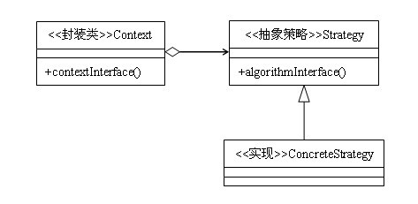

定义：定义一组算法，将每个算法都封装起来，并且使他们之间可以互换。

类型：行为类模式

类图：



策略模式是对算法的封装，把一系列的算法分别封装到对应的类中，并且这些类实现相同的接口，相互之间可以替换。在前面说过的行为类模式中，有一种模式也是关注对算法的封装——模版方法模式，对照类图可以看到，策略模式与模版方法模式的区别仅仅是多了一个单独的封装类Context，它与模版方法模式的区别在于：在模版方法模式中，调用算法的主体在抽象的父类中，而在策略模式中，调用算法的主体则是封装到了封装类Context中，抽象策略Strategy一般是一个接口，目的只是为了定义规范，里面一般不包含逻辑。其实，这只是通用实现，而在实际编程中，因为各个具体策略实现类之间难免存在一些相同的逻辑，为了避免重复的代码，我们常常使用抽象类来担任Strategy的角色，在里面封装公共的代码，因此，在很多应用的场景中，在策略模式中一般会看到模版方法模式的影子。

## 1. 策略模式的结构

- 封装类：也叫上下文，对策略进行二次封装，目的是避免高层模块对策略的直接调用。
- 抽象策略：通常情况下为一个接口，当各个实现类中存在着重复的逻辑时，则使用抽象类来封装这部分公共的代码，此时，策略模式看上去更像是模版方法模式。
- 具体策略：具体策略角色通常由一组封装了算法的类来担任，这些类之间可以根据需要自由替换。

策略模式代码实现

```java
interface IStrategy {  
    public void doSomething();  
}  
class ConcreteStrategy1 implements IStrategy {  
    public void doSomething() {  
        System.out.println("具体策略1");  
    }  
}  
class ConcreteStrategy2 implements IStrategy {  
    public void doSomething() {  
        System.out.println("具体策略2");  
    }  
}  
class Context {  
    private IStrategy strategy;  

    public Context(IStrategy strategy){  
        this.strategy = strategy;  
    }  

    public void execute(){  
        strategy.doSomething();  
    }  
}  

public class Client {  
    public static void main(String[] args){  
        Context context;  
        System.out.println("-----执行策略1-----");  
        context = new Context(new ConcreteStrategy1());  
        context.execute();  

        System.out.println("-----执行策略2-----");  
        context = new Context(new ConcreteStrategy2());  
        context.execute();  
    }  
}  
```

## 2. 策略模式的优缺点

策略模式的主要优点有：

策略类之间可以自由切换，由于策略类实现自同一个抽象，所以他们之间可以自由切换。
易于扩展，增加一个新的策略对策略模式来说非常容易，基本上可以在不改变原有代码的基础上进行扩展。
避免使用多重条件，如果不使用策略模式，对于所有的算法，必须使用条件语句进行连接，通过条件判断来决定使用哪一种算法，在上一篇文章中我们已经提到，使用多重条件判断是非常不容易维护的。

策略模式的缺点主要有两个：

维护各个策略类会给开发带来额外开销，可能大家在这方面都有经验：一般来说，策略类的数量超过5个，就比较令人头疼了。

必须对客户端（调用者）暴露所有的策略类，因为使用哪种策略是由客户端来决定的，因此，客户端应该知道有什么策略，并且了解各种策略之间的区别，否则，后果很严重。例如，有一个排序算法的策略模式，提供了快速排序、冒泡排序、选择排序这三种算法，客户端在使用这些算法之前，是不是先要明白这三种算法的适用情况？再比如，客户端要使用一个容器，有链表实现的，也有数组实现的，客户端是不是也要明白链表和数组有什么区别？就这一点来说是有悖于迪米特法则的。

## 3. 适用场景

做面向对象设计的，对策略模式一定很熟悉，因为它实质上就是面向对象中的继承和多态，在看完策略模式的通用代码后，我想，即使之前从来没有听说过策略模式，在开发过程中也一定使用过它吧？至少在在以下两种情况下，大家可以考虑使用策略模式，

几个类的主要逻辑相同，只在部分逻辑的算法和行为上稍有区别的情况。

有几种相似的行为，或者说算法，客户端需要动态地决定使用哪一种，那么可以使用策略模式，将这些算法封装起来供客户端调用。

策略模式是一种简单常用的模式，我们在进行开发的时候，会经常有意无意地使用它，一般来说，策略模式不会单独使用，跟模版方法模式、工厂模式等混合使用的情况比较多。
