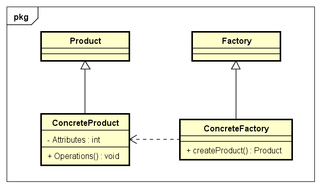

## 1. 模式的定义

定义一个用户创建对象的接口，让子类决定将哪一个类实例化。工厂方法使一个类的实例化延迟到子类。

## 2. 使用场景

- 需要使用工厂替代new的场景(创建对象有较多重复的代码)；
- 需要隐藏具体实现，并且使抽象与实现解耦合；
- 需要灵活、可扩展的框架，且具体类型不多时。

## 3. UML类图



## 4. 角色介绍

- Product : 产品的抽象类
- ConcreteProduct : 具体的产品
- Factory : 工厂的抽象类
- ConcreteFactory : 工厂的具体实现

## 5. 简单示例

在平时使用操作系统时我们都知道不同系统的UI风格是很不一样的，我们可以通过这个示例来简单学习一下工厂方法模式。可以将UI的风格抽象为一个抽象类， 让不同的系统各自实现自己的UI风格，再通过具体工厂获取具体的系统风格。

```java
package com.dp.example.factorymethod;  
/**
 * 窗口风格抽象类， 对应的是Product角色
 * @author mrsimple
 *
 */  
public abstract class WindowStyle {  
    public abstract void useThisStyle();  
}  


package com.dp.example.factorymethod;  

/**
 * mac系统窗口风格, 对应的是concreteProduct角色
 * @author mrsimple
 *
 */  
public class MacWindowStyle extends WindowStyle {  

    @Override  
    public void useThisStyle() {  
        System.out.println("this is mac style.");  
    }  

}  


package com.dp.example.factorymethod;  

/**
 * Ubuntu系统风格，对应的是concreteProduct角色
 * @author mrsimple
 *
 */  
public class UbuntuWindowStyle extends WindowStyle {  

    @Override  
    public void useThisStyle() {  
        System.out.println("this is ubuntu style.");  
    }  

}  


package com.dp.example.factorymethod;  
/**
 * 工厂类, 对应Factory角色
 * @author mrsimple
 *
 */  
public  abstract class ThemeFactory {  
    public abstract WindowStyle createWindowStyle()  ;  
}  


package com.dp.example.factorymethod;  

/**
 * MAC系统工厂， 对应concreteFactory角色，获取mac系统风格的主题
 *  
 * @author mrsimple
 *
 */  
public class MacWindThemeFactory extends ThemeFactory {  

    @Override  
    public WindowStyle createWindowStyle() {  
        return new MacWindowStyle();  
    }  

}
```

上面的示例中，将Window Style的实例化从ThemeFactory类延迟到MacWindThemeFactory中，使得整个产品类和工厂类更易于扩展，也向客户程序隐藏了具体的实现。

```java
public static void main(String[] args) {  

    ThemeFactory tf = new MacWindThemeFactory() ;  
    WindowStyle winStyle = tf.createWindowStyle() ;  
    winStyle.useThisStyle();  
}  
```

## 6. 源码分析

在Android的开发中，容器类通常是我们开发软件过程中不可缺少的基础组件，例如ArrayList, HashMap, HashSet等，而迭代容器中的元素是最常用的功能之一，

容器中的迭代器就是用了工厂方法设计模式(当然还有迭代器模式, 不在此讨论)。我们知道，不同的容器类型其内部数据结构是不同的,相应的，其迭代器类型也不相同，使用工厂方法模式将迭代器的具体类型延迟到具体容器类中，符合常理，也更灵活。下面是ArrayList的简单使用。

```java
List<Integer> myIntegers = new ArrayList<Integer>() ;  
myIntegers.add(1) ;  
myIntegers.add(2) ;  
myIntegers.add(3) ;  

Iterator<Integer> iter = myIntegers.iterator() ;  
while (iter.hasNext()) {  
    int item = iter.next();  
    System.out.println("Item : " + item);  
}  
```
这就是我们使用容器类的简单示例，下面我们看看容器类中的工厂方法实现原理。
ArrayList容器返回迭代器的方法iterator()声明在List接口中，该类声明了通用的集合类接口，ArrayList实现了List接口。

```java
public class ArrayList<E> extends AbstractList<E>  
        implements List<E>, RandomAccess, Cloneable, java.io.Serializable
```

我们看看List中的iterator声明如下 :

```java
/**
 * Returns an iterator over the elements in this list in proper sequence.
 *
 * @return an iterator over the elements in this list in proper sequence
 */  
Iterator<E> iterator();
```

该方法返回一个迭代器对象，Iterator<E>是一个接口。含有三个方法，如下 :

```java
 * @author  Josh Bloch     《Effective java》的作者  
 * @see Collection  
 * @see ListIterator  
 * @see Iterable  
 * @since 1.2  
 */  
public interface Iterator<E> {  

    boolean hasNext();  

    E next();  

    void remove();  
}  
```

我们继续回到ArrayList类，查看iterator方法，可以看到该方法返回了一个ArrayListIterator类型的迭代器

```java
@Override public Iterator<E> iterator() {  
    return new ArrayListIterator();  
}  
```

跟踪到ArrayListIterator类型， 如下 :

```java
private class ArrayListIterator implements Iterator<E> {  
        /** Number of elements remaining in this iteration */  
        private int remaining = size;  

        /** Index of element that remove() would remove, or -1 if no such elt */  
        private int removalIndex = -1;  

        /** The expected modCount value */  
        private int expectedModCount = modCount;  

        public boolean hasNext() {  
            return remaining != 0;  
        }  

        @SuppressWarnings("unchecked") public E next() {  
            ArrayList<E> ourList = ArrayList.this;  
            int rem = remaining;  
            if (ourList.modCount != expectedModCount) {  
                throw new ConcurrentModificationException();  
            }  
            if (rem == 0) {  
                throw new NoSuchElementException();  
            }  
            remaining = rem - 1;  
            return (E) ourList.array[removalIndex = ourList.size - rem];  
        }  

        public void remove() {  
            Object[] a = array;  
            int removalIdx = removalIndex;  
            if (modCount != expectedModCount) {  
                throw new ConcurrentModificationException();  
            }  
            if (removalIdx < 0) {  
                throw new IllegalStateException();  
            }  
            System.arraycopy(a, removalIdx + 1, a, removalIdx, remaining);  
            a[--size] = null;  // Prevent memory leak  
            removalIndex = -1;  
            expectedModCount = ++modCount;  
        }  
    }
```

该迭代器就是实现了对ArrayList容器的元素的访问、移除、判断是否还有下一个元素这三个操作。
现在所有的角色都已经列举完毕了，我们再来理一理它们的逻辑。

首先Iterator代表的角色是Product，

抽象了一个通用的接口类型， ArrayListIterator代表concreteProduct类型，即具体实现类型。List扮演了Factory角色， 是一个声明了创建Iterator对象的接口， ArrayList代表ConcreteFactory角色， 创建具体的Iterator对象， 即ArrayListIterator。将迭代器Iterator的创建从List延迟到了ArrayList，这就是工厂方法模式。

## 7. 优点与缺点

优点:

- 多态性：客户代码可以做到与特定应用无关，适用于任何实体类
  子类可以重新新的实现，也可以继承父类的实现。加一层间接性，增加了灵活性。
- 良好的封装性，代码结构清晰。扩展性好，在增加产品类的情况下，只需要适当修改具体的工厂类或扩展一个工厂类，就可“拥抱变化”屏蔽产品类。
- 产品类的实现如何变化，调用者不需要关心，只需要关心产品的接口，只要接口保持不变，系统的上层模块就不会发生变化。
- 耦合度低，高层模块只需要知道产品的抽象类，其他的实现都不需要关心。

缺点：

需要Creator和相应的子类作为factory method的载体，如果应用模型确实需要creator和子类存在，则很好；否则的话，需要增加一个类层次。
