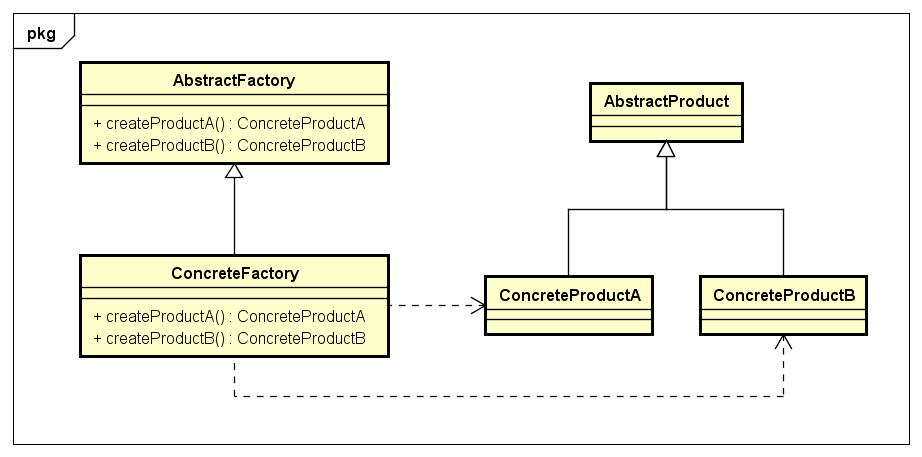

## 1. 模式的定义

为创建一组相关或相互依赖的对象提供一个接口，而无需指定它们具体的类。

## 2. 使用场景

一个对象族或者一组没有任何关系的对象都有相同的约束，都可以使用抽象工厂模式(工厂方法模式是一个具体工厂创建一个类型的对象，抽象工厂模式是一个具体工厂创建一个产品族或者一系列的产品对象)。例如一个文本编辑器和一个图片处理器都是软件，但是Mac下的文本编辑器和 Windows 下的文本编辑器虽然功能和界面都相同，但是代码实现是不同的，图片处理软件也有类似情况。也就是具有了共同的约束条件：操作系统类型。于是我们可以使用抽象工厂模式，产生不同操作系统下的编辑器和图像浏览器。

## 3. UML类图




## 4. 角色介绍

- AbstractProduct: 抽象产品类
- ConcreteProductA : 产品的具体实现A
- ConcreteProductB : 产品的具体实现B
- AbstractFactory : 抽象工厂
- ConcreteFactory : 具体工厂实现

## 5. 简单示例
下面我们以上文中提到的文本编辑器和图像处理器来简单演示一下抽象工厂模式的使用。

```java
/**
 * 抽象的Product, 文本编辑器抽象类
 *  
 * @author mrsimple
 *
 */  
public abstract class TextEditor {  
    public abstract void edit();  

    public abstract void save();  
}  

/**
 * 抽象产品类, 图像处理软件
 *  
 * @author mrsimple
 *
 */  
public abstract class ImageEditor {  
    public abstract void edit();  

    public abstract void save();  
}  

/**
 * MAC系统下文本编辑器的实现
 * @author mrsimple
 *
 */  
public class MacTextEditor extends TextEditor {  

    @Override  
    public void edit() {  
        System.out.println("文本编辑器,edit -- Mac版");  
    }  

    @Override  
    public void save() {  
        System.out.println("文本编辑器, save -- Mac版");  
    }  

}  

/**
 *  
 * MAC系统下图像编辑器的实现
 * @author mrsimple
 *
 */  
public class MacImageEditor extends ImageEditor {  

    @Override  
    public void edit() {  
        System.out.println("图片处理编辑器,edit -- Mac版");  
    }  

    @Override  
    public void save() {  
        System.out.println("图片处理编辑器, save -- Mac版");  
    }  

}  

/**
 * 应用软件抽象工厂
 * classes.
 *  
 * @author mrsimple
 *
 */  
public abstract class AppFactory {  
    public abstract TextEditor createTextEditor();  

    public abstract ImageEditor createImageEditor();  
}  

/**
 * 具体工厂, 创建各种应用, 这里为文本编辑器和图像编辑器.
 *  
 * @author mrsimple
 *
 */  
public class MacAppFactory extends AppFactory {  

    @Override  
    public TextEditor createTextEditor() {  
        return new MacTextEditor();  
    }  

    @Override  
    public ImageEditor createImageEditor() {  
        return new MacImageEditor();  
    }  

}
```

上面的示例中给出了文本处理器和图像处理器的MAC版实现，AppFactory中定义了创建文本编辑器和图像编辑器的函数( 创建应用软件这一类的产品族 )，并在MacAppFactory具体实现，创建Mac下实现的两种编辑器。同样，我们可以实现Windows下的两种编辑器的实现，然后再实现一个Windows下的App工厂，通过该工厂返回windows下的编辑器的具体实现的对象。这样，我们就可以通过工厂提供的接口创建整个产品族的对象。

```java
AppFactory factory = new MacAppFactory();  
TextEditor textEditor = factory.createTextEditor();  
textEditor.edit();  
textEditor.save();  

ImageEditor imageEditor = factory.createImageEditor();  
imageEditor.edit();  
imageEditor.save();  
```

输出结果


## 6. 源码分析

在源码中, 比较典型的抽象工厂模式的例子是Java.sql包中的Connection类，在刚学习Java时我们都会学习使用JDBC链接数据库，代码大致是这样的.

```java
try {  
    Connection con = null; // 定义一个MYSQL链接对象  
    Class.forName("com.mysql.jdbc.Driver").newInstance(); // MYSQL驱动  
    con = DriverManager.getConnection(  
            "jdbc:mysql://127.0.0.1:3306/test", "root", "root"); // 链接本地MYSQL  

    Statement stmt; // 创建声明  
    stmt = con.createStatement();  

    // 新增一条数据  
    stmt.executeUpdate("INSERT INTO user (username, password) VALUES ('init', '123456')");  
    ResultSet res = stmt.executeQuery("select LAST_INSERT_ID()");  
    // 代码省略  
} catch (Exception e) {  
    e.printStackTrace();  
}
```

上面我们是以MYSQL驱动为例，设置JDBC驱动以后，使用DriverManager.getConnection来获取具体的链接实现，然后通过这个Connection来创建一个Statement来提交SQL语句，Connection还可以创建clob, blob, sqlxml等对象，即Connection就是抽象工厂，而具体的工厂实现则在不同的数据库驱动包种。

首先我们看DriverManager中的getConnection方法 :

```java
    @CallerSensitive  
    public static Connection getConnection(String url,  
        String user, String password) throws SQLException {  
        java.util.Properties info = new java.util.Properties();  

        if (user != null) {  
            info.put("user", user);  
        }  
        if (password != null) {  
            info.put("password", password);  
        }  

        return (getConnection(url, info, Reflection.getCallerClass()));  
    }  

//  Worker method called by the public getConnection() methods.  
    private static Connection getConnection(  
        String url, java.util.Properties info, Class<?> caller) throws SQLException {  
        /*
         * When callerCl is null, we should check the application's
         * (which is invoking this class indirectly)
         * classloader, so that the JDBC driver class outside rt.jar
         * can be loaded from here.
         */  
        ClassLoader callerCL = caller != null ? caller.getClassLoader() : null;  
        synchronized (DriverManager.class) {  
            // synchronize loading of the correct classloader.  
            if (callerCL == null) {  
                callerCL = Thread.currentThread().getContextClassLoader();  
            }  
        }  

        if(url == null) {  
            throw new SQLException("The url cannot be null", "08001");  
        }  

        println("DriverManager.getConnection(\"" + url + "\")");  

        // Walk through the loaded registeredDrivers attempting to make a connection.  
        // Remember the first exception that gets raised so we can reraise it.  
        SQLException reason = null;  

        for(DriverInfo aDriver : registeredDrivers) {  
            // If the caller does not have permission to load the driver then  
            // skip it.  
            if(isDriverAllowed(aDriver.driver, callerCL)) {  
                try {  
                    println("    trying " + aDriver.driver.getClass().getName());  
                    Connection con = aDriver.driver.connect(url, info);  
                    if (con != null) {  
                        // Success!  
                        println("getConnection returning " + aDriver.driver.getClass().getName());  
                        return (con);  
                    }  
                } catch (SQLException ex) {  
                    if (reason == null) {  
                        reason = ex;  
                    }  
                }  

            } else {  
                println("    skipping: " + aDriver.getClass().getName());  
            }  

        }  

        // if we got here nobody could connect.  
        if (reason != null)    {  
            println("getConnection failed: " + reason);  
            throw reason;  
        }  

        println("getConnection: no suitable driver found for "+ url);  
        throw new SQLException("No suitable driver found for "+ url, "08001");  
    }
```

我们看到getConnection(String, String, String)函数调用了getConnection(Stringurl, java.util.Propertiesinfo,Class<?>caller)函数，在该函数中遍历以注册到DriverManager中的驱动，即registeredDrivers， 获取相应的驱动之后，链接到数据库，最后将该链接返回, 这样就获取到了具体的Connection, 代码为 :

```java
Connection con = aDriver.driver.connect(url, info);  
if (con != null) {  
    // Success!  
    println("getConnection returning " + aDriver.driver.getClass().getName());  
    return (con);  
}
```

那么MYSQL JDBC驱动是什么时候注册到DriverManager的呢 ？

我们看到在使用DriverManager之前，调用了以下这句代码 :

```java
Class.forName("com.mysql.jdbc.Driver").newInstance(); // MYSQL驱动  
```

这句代码的作用就是通过反射来创建com.mysql.jdbc.Driver对象， 我们看看mysql jdbc驱动中该类的实现.

```java
package com.mysql.jdbc;  

import java.sql.DriverManager;  
import java.sql.SQLException;  

public class Driver extends NonRegisteringDriver  
  implements java.sql.Driver  
{  
  public Driver()  
    throws SQLException  
  {  
  }  

  static  
  {  
    try  
    {  
      DriverManager.registerDriver(new Driver());  
    } catch (SQLException E) {  
      throw new RuntimeException("Can't register driver!");  
    }  
  }  
}
```

可以看到，上文中有一个静态语句块， 该语句块会在虚拟机第一次加载该类时首先执行， 该语句块的作用就是将Driver类的对象注册到DriverManager中，驱动的具体实现类为 NonRegisteringDriver。获取数据库驱动对象以后，我们需要调用驱动对象的connect(String, Properties)函数才能获取到Connection对象，我们看看 NonRegisteringDriver的connect(String, Properties)。

```java
public java.sql.Connection connect(String url, Properties info)  
  throws SQLException  
{  
  if (url != null) {  
    if (StringUtils.startsWithIgnoreCase(url, "jdbc:mysql:loadbalance://"))  
      return connectLoadBalanced(url, info);  
    if (StringUtils.startsWithIgnoreCase(url, "jdbc:mysql:replication://"))  
    {  
      return connectReplicationConnection(url, info);  
    }  
  }  

  Properties props = null;  

  if ((props = parseURL(url, info)) == null) {  
    return null;  
  }  
  try  
  {  
    return new Connection(host(props), port(props), props, database(props), url);  
  }  
  catch (SQLException sqlEx)  
  {  
    throw sqlEx;  
  } catch (Exception ex) {  
    throw SQLError.createSQLException(Messages.getString("NonRegisteringDriver.17") + ex.toString() + Messages.getString("NonRegisteringDriver.18"), "08001");  
  }  
}
```
通过分析代码，返回的是com.mysql.jdbc.Connection类的对象， 即 return return new Connection(host(props), port(props), props, database(props), url)这句， 该Connection实现了java.sql.Connection声明的接口，这就是mysql数据库连接的具体实现。

现在我们来理一下思路， java.sql包中的Statement, Clob, Blob, SQLXML都是扮演了抽象产品类族中的一员， 而java.sql.Connection则代表了抽象工厂类，里面有创建各个产品类的函数，具体的产品实现类、具体Connection工厂都封装在各个数据库驱动包中，通过Connection我们就可以创建Statement, Clob等同一类族中的对象。抽象与实现想分离，工厂可以创建一组相关的对象，客户代码使用较为简单。

## 7. 优点与缺点

优点 :

- 抽象工厂模式隔离了具体类的生产，使得客户并不需要知道什么被创建；
- 容易改变产品的系列；
- 增加新的具体工厂和产品族很方便，无须修改已有系统，符合“开闭原则”。
- 将一个系列的产品族统一到一起创建，客户代码易于使用。

缺点 :

抽象工厂模式的最大缺点就是产品族扩展非常困难，为什么这么说呢？我们以通用代码为例，如果要增加一个产品 C， 也就是说产品家族由原来的 2 个增加到 3 个，看看我们的程序有多大改动吧！抽象类 AbstractCreator 要增加一个方法 createProductC()， 然后两个实现类都要修改，想想看，这严重违反了开闭原则，而且我们一直说明抽象类和接口是一个契约。

在使用JDBC为例是因为没有在Android源码中找到合适的例子，如果其他朋友有发现，可以知会一声，不甚感激。
