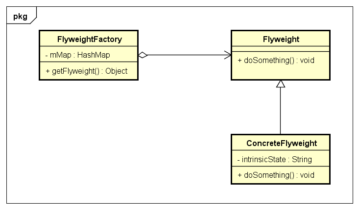

## **1. 概述**

当一个软件系统在运行时产生的对象数量太多，将导致运行代价过高，带来系统性能下降等问题。所以需要采用一个共享来避免大量拥有相同内容对象的开销。在Java中，String类型就是使用了享元模式。String对象是final类型，对象一旦创建就不可改变。在Java中字符串常量都是存在常量池中的，Java会确保一个字符串常量在常量池中只有一个拷贝。

是对对象池的一种实现，共享对象，避免重复的创建，采用一个共享来避免大量拥有相同内容对象的开销。使用享元模式可有效支持大量的细粒度对象。

Flyweight，如果很多很小的对象它们有很多相同的东西，并且在很多地方用到，那就可以把它们抽取成一个对象，把不同的东西变成外部的属性，作为方法的参数传入。

String类型的对象创建后就不可改变，如果当两个String对象所包含的内容相同时，JVM只创建一个String对象对应这两个不同的对象引用。字符串常量池

Android中的Message

## **2. 核心思想**

概念： 运用共享技术有效地支持大量细粒度对象的复用。系统只使用少量的对象，而这些对象都很相似，状态变化很小，可以实现对象的多次复用。由于享元模式要求能够共享的对象必须是细粒度对象，因此它又称为轻量级模式，它是一种对象结构型模式。

对象共享，避免创建多对象。是对象池的一种实现。

对象容器Map<对象的内部状态，对象>，消息池

享元对象共享的关键是区分了内部状态(Intrinsic State)和外部状态(Extrinsic State)。

- **内部状态**

存储在享元对象内部并且不会随环境改变而改变的状态，内部状态可以共享。

- **外部状态**

享元对象的外部状态通常由客户端保存，并在享元对象被创建之后，需要使用的时候再传入到享元对象内部。随环境改变而改变的、不可以共享的状态。一个外部状态与另一个外部状态之间是相互独立的。

由于区分了内部状态和外部状态，我们可以将具有相同内部状态的对象存储在享元池中，享元池中的对象是可以实现共享的，需要的时候就将对象从享元池中取出，实现对象的复用。通过向取出的对象注入不同的外部状态，可以得到一系列相似的对象，而这些对象在内存中实际上只存储一份。

## 3. 享元模式分类

- 单纯享元模式
- 复合享元模式

### 3.1 单纯享元模式结构重要核心模块



**抽象享元角色**：为具体享元角色规定了必须实现的方法，而外部状态就是以参数的形式通过此方法传入。在Java中可以由抽象类、接口来担当。

**具体享元角色**：实现抽象角色规定的方法。如果存在内部状态，就负责为内部状态提供存储空间。

**享元工厂角色**：负责创建和管理享元角色。要想达到共享的目的，这个角色的实现是关键！

**客户端角色**：维护对所有享元对象的引用，而且还需要存储对应的外部状态。

单纯享元模式和创建型的简单工厂模式实现上非常相似，但是它的重点或者用意却和工厂模式截然不同。工厂模式的使用主要是为了使系统不依赖于实现得细节；而在享元模式的主要目的是避免大量拥有相同内容对象的开销。

```java
public interface Ticket{
    public void showTicketInfo(String bunk);
}

class TrainTicket implements Ticket{
    
    public String from;
    public String to;
    public String bunk;
    public int price;

    public TrainTicket(String from, String to) {
        this.from = from;
        this.to = to;
    }

    @Override
    public void showTicketInfo(String bunk) {
        // 省略代码
    }
}

public class TicketFactory{
    static Map<String,Ticket> sTicketMap = new ConcurrentHashMap<>();
    
    public static Ticket getTicket(String from, String to){
        String key = from + "-" + to;
        if (sTicketMap.containsKey(key)){
            return sTicketMap.get(key);
        }else {
            Ticket ticket = new TrainTicket(from, to);
            sTicketMap.put(key,ticket);
            return ticket;
        }
    }
}
```

### 3.2 复合享元模式结构重要核心模块

抽象享元角色：为具体享元角色规定了必须实现的方法，而外部状态就是以参数的形式通过此方法传入。在Java中可以由抽象类、接口来担当。

**具体享元角色**：实现抽象角色规定的方法。如果存在内部状态，就负责为内部状态提供存储空间。

**复合享元角色**：它所代表的对象是不可以共享的，并且可以分解成为多个单纯享元对象的组合。

**享元工厂角色**：负责创建和管理享元角色。要想达到共享的目的，这个角色的实现是关键！

**客户端角色**：维护对所有享元对象的引用，而且还需要存储对应的外部状态。

## **4. 使用场景**

- 一个系统有大量相同或者相似的对象，造成内存的大量耗费。
- 对象的大部分状态都可以外部化，可以将这些外部状态传入对象中。
- 在使用享元模式时需要维护一个存储享元对象的享元池，而这需要耗费一定的系统资源，因此，应当在需要多次重复使用享元对象时才值得使用享元模式。

## **5. 程序猿实例**

1、单纯享元模式实例：例子完全就是核心点的文字翻译代码，不做过多解释。

```java
package yanbober.github.io;

import java.util.HashMap;
import java.util.Map;

//抽象享元角色类
interface ICustomerString {
    //外部状态以参数的形式通过此方法传入
    void opt(String state);
}
//具体享元角色类
class CustomerStringImpl implements ICustomerString {
    //负责为内部状态提供存储空间
    private Character mInnerState = null;

    public CustomerStringImpl(Character mInnerState) {
        this.mInnerState = mInnerState;
    }

    @Override
    public void opt(String state) {
        System.out.println("Inner state = "+this.mInnerState);
        System.out.println("Out state = "+state);
    }
}
//享元工厂角色类
//一般而言，享元工厂对象在整个系统中只有一个，因此也可以使用单例模式
class CustomerStringFactory {
    private Map<Character, ICustomerString> map = new HashMap<>();

    public ICustomerString factory(Character state) {
        ICustomerString cacheTemp = map.get(state);
        if (cacheTemp == null) {
            cacheTemp = new CustomerStringImpl(state);
            map.put(state, cacheTemp);
        }
        return cacheTemp;
    }
}
//客户端
public class Main {
    public static void main(String[] args) {
        CustomerStringFactory factory = new CustomerStringFactory();
        ICustomerString customerString = factory.factory(new Character('Y'));
        customerString.opt("YanBo");

        customerString = factory.factory(new Character('B'));
        customerString.opt("Bob");

        customerString = factory.factory(new Character('Y'));
        customerString.opt("Jesse");
    }
}
```
运行结果：

```
Inner state = Y
Out state = YanBo
Inner state = B
Out state = Bob
Inner state = Y
Out state = Jesse
```
上边示例结果一目了然可以看出来简单享元模式的特点。

2、复合享元模式实例：如下例子就是一个复合享元模式，添加了复合对象，具体如下

```java
package yanbober.github.io;

import java.util.*;

//抽象享元角色类
interface ICustomerString {
    //外部状态以参数的形式通过此方法传入
    void opt(String state);
}
//具体享元角色类
class CustomerStringImpl implements ICustomerString {
    //负责为内部状态提供存储空间
    private Character mInnerState = null;

    public CustomerStringImpl(Character mInnerState) {
        this.mInnerState = mInnerState;
    }

    @Override
    public void opt(String state) {
        System.out.println("Inner state = "+this.mInnerState);
        System.out.println("Out state = "+state);
    }
}
//复合享元对象
class MultipleCustomerStringImpl implements ICustomerString {
    private Map<Character, ICustomerString> map = new HashMap<>();

    public void add(Character key, ICustomerString value) {
        map.put(key, value);
    }

    @Override
    public void opt(String state) {
        ICustomerString temp;
        for (Character obj : map.keySet()) {
            temp = map.get(obj);
            temp.opt(state);
        }
    }
}
//享元工厂角色类
class CustomerStringFactory {
    //一般而言，享元工厂对象在整个系统中只有一个，因此也可以使用单例模式
    private Map<Character, ICustomerString> map = new HashMap<>();
    //上例的单纯享元模式
    public ICustomerString factory(Character state) {
        ICustomerString cacheTemp = map.get(state);
        if (cacheTemp == null) {
            cacheTemp = new CustomerStringImpl(state);
            map.put(state, cacheTemp);
        }

        return cacheTemp;
    }
    //复合享元模式
    public ICustomerString factory(List<Character> states) {
        MultipleCustomerStringImpl impl = new MultipleCustomerStringImpl();
        for (Character state : states) {
            impl.add(state, this.factory(state));
        }

        return impl;
    }
}
//客户端
public class Main {
    public static void main(String[] args) {
        List<Character> states = new ArrayList<>();
        states.add('Y');
        states.add('A');
        states.add('N');
        states.add('B');
        states.add('O');

        states.add('Y');
        states.add('B');

        CustomerStringFactory factory = new CustomerStringFactory();
        ICustomerString customerString1 = factory.factory(states);
        ICustomerString customerString2 = factory.factory(states);

        customerString1.opt("Mutex object test!");
    }
}
```
## **6. 总结**

从上面代码你可以发现，由于享元模式的复杂，实际应用也不是很多，这是我们更加无法看清他的真面目了。不过享元模式并不是鸡肋，它的精髓是共享，是对我们系统优化非常有好处的，而且这种思想已经别越来越多的应用，这应该就算是享元模式的应用了吧。

### **享元模式优点**

- 可以极大减少内存中对象的数量，使得相同或相似对象在内存中只保存一份，从而可以节约系统资源，提高系统性能。
- 享元模式的外部状态相对独立，而且不会影响其内部状态，从而使得享元对象可以在不同的环境中被共享。

### **享元模式缺点**

- 享元模式使得系统变得复杂，需要分离出内部状态和外部状态，这使得程序的逻辑复杂化。
- 为了使对象可以共享，享元模式需要将享元对象的部分状态外部化，而读取外部状态将使得运行时间变长。

> 原文出处：http://blog.csdn.net/yanbober/article/details/45477551

## Android中的享元模式

```java
public final class Message implements Parcelable {
  
  	// sometimes we store linked lists of these things
    /*package*/ Message next;
    private static final Object sPoolSync = new Object();
    private static Message sPool;
    private static int sPoolSize = 0;
  	
  	

}
```

Message消息池没有使用Map这样的容器，使用的是链表。在回收Message时把该对象添加到链表中。


```java
    /**
     * Return a new Message instance from the global pool. Allows us to
     * avoid allocating new objects in many cases.
     */
    public static Message obtain() {
        synchronized (sPoolSync) {
            if (sPool != null) {
                Message m = sPool;
                sPool = m.next;
                m.next = null;
                m.flags = 0; // clear in-use flag
                sPoolSize--;
                return m;
            }
        }
        return new Message();
    }

    /**
     * Return a Message instance to the global pool.
     * <p>
     * You MUST NOT touch the Message after calling this function because it has
     * effectively been freed.  It is an error to recycle a message that is currently
     * enqueued or that is in the process of being delivered to a Handler.
     * </p>
     */
    public void recycle() {
        if (isInUse()) {
            if (gCheckRecycle) {
                throw new IllegalStateException("This message cannot be recycled because it "
                        + "is still in use.");
            }
            return;
        }
        recycleUnchecked();
    }

    /**
     * Recycles a Message that may be in-use.
     * Used internally by the MessageQueue and Looper when disposing of queued Messages.
     */
    void recycleUnchecked() {
        // Mark the message as in use while it remains in the recycled object pool.
        // Clear out all other details.
        flags = FLAG_IN_USE;
        what = 0;
        arg1 = 0;
        arg2 = 0;
        obj = null;
        replyTo = null;
        sendingUid = -1;
        when = 0;
        target = null;
        callback = null;
        data = null;

        synchronized (sPoolSync) {
            if (sPoolSize < MAX_POOL_SIZE) {
                next = sPool;
                sPool = this;
                sPoolSize++;
            }
        }
    }
```