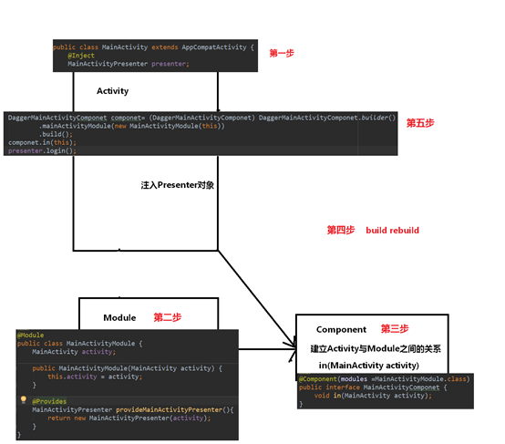

## 1. Dagger2

依赖注入是面向对象编程的一种设计模式，其目的是为了降低程序耦合，这个耦合就是类之间的依赖引起的。

### 1.1 什么是Dagger2?

Dagger是为Android和Java平台提供的在编译时进行依赖注入的框架。
编译时：编译时生成代码（rebulid），我们完成所需对象的注入。（假设使用反射，应该是什么时候起作用?）。

### 1.2 为什么使用Dagger2?

Dagger2解决了基于反射带来的开发和性能上的问题。

### 1.3 做什么工作？

Dagger2主要用于做界面和业务之间的隔离

### 1.4 引入配置

添加dagger2的依赖
```gradle
compile 'com.google.dagger:dagger:2.6'
```
编译时生成代码的插件配置（android-apt）

- project的gradle中添加

```gradle
buildscript {
		dependencies {
  			classpath 'com.neenbedankt.gradle.plugins:android-apt:1.8'
		}
}
```
- apt插件的使用

modle的gradle中添加

```gradle
apply plugin: 'com.neenbedankt.android-apt'
```
- 关联Dagger2

```gradle
dependencies {
	apt 'com.google.dagger:dagger-compiler:2.6'
}
```
### 1.5 操作步骤



```java
// 第一步
public class MainActivity extends AppCompatActivity{
	@Inject
	MainActivityPresenter presenter;
}

// 第二步

@Module
public class  MainActivityModule{
  MainActivity activity;
  
  public MainActivityModule(MainActivity activity){
  	this.activity = activity;  
  }
  
  @provides
  MainActivityPresenter provideMainActivityPresenter(){
    return new MainActivityPresenter(activity);
  }
}

// 第三步
// Component，建立Activity和Module之间的关系
// in(MainActivity activity)

@Component(module = MainActivityModule.class)

public interface MainActivityComponent{
  void inject(MainActivity activity);
}
// 第四步 build rebuild

// 第五步 注入presenter对象
DaggerMainActivityComponent component = (DaggerMainActivityComponent)DaggerMainActivityComponent.builder()
	.mainActivityModule(new MainActivityModule(this))
	.build();
component.in(this);
presenter.login();
```

## 2. 深入解析

在操作中会使用到@Inject、@Module、@Provides、@Conponent注解，那么他们分别在完成什么工作?


| 注解            | 功能说明                                     |
| :------------ | :--------------------------------------- |
| @Inject       | 使用在类的构造方法上或属性上，当看到某个类被@Inject标记时，就会到他的构造方法中，如果这个构造方法也被@Inject标记的话，就会自动初始化这个类，从而完成依赖注入 |
| @Conponent    | 用来将@Inject和@Module联系起来的桥梁，从@Module中获取依赖并将依赖注入给@Inject。一个接口或者抽象类，在这个接口中定义了一个inject()方法，rebuild一下项目，会生成一个以Dagger为前缀的Component类。 |
| @Subcomponent | 子组件                                      |
| @Module       | 用来提供依赖，为那些没有构造函数的类提供依赖，比如第三方类库，系统类。里面定义一些用@Provides注解的以provide开头的方法，这些方法就是所提供的依赖，Dagger2会在该类中寻找实例化某个类所需要的依赖 |
| @Provides     | Module中的创建类实例方法用Provides进行标注。方法名可以是任意的有意义的名字，Component会根据返回值来提供依赖 |
| @Qualifier    | 通过自定义Qulifier，可以告诉Dagger2去需找具体的依赖提供者。 帮助我们去为相同接口的依赖创建“tags” |
| @Scope        | 在作用域内保持单例，可以直接理解为单例即可。同属于一个作用域的时候会公用一个相同的实例 |
| @MapKey       | 这个注解用在定义一些依赖集合                           |
| @Singleton    | @Singleton并不是我们设计模式中的单例模式，而是Dagger2中为了保持一个产品在一个Scope中只有一个对象的标签 |
### 2.1 Inject

```java
//用这个标注标识是一个连接器
@Component()
public interface MainActivityComponent {
//这个连接器要注入的对象。这个inject标注的意思是，我后面的参数对象里面有标注为@Inject的属性，这个标注的属性是需要这个连接器注入进来的。也就是我们的使用方
void inject(MainActivity activity);
}
```

### 2.2 Component

Component需要引用到目标类的实例，Component会查找目标类中用Inject注解标注的属性，查找到相应的属性后会接着查找该属性对应的用Inject标注的构造函数，剩下的工作就是初始化该属性的实例并把实例进行赋值

一端连接目标类，另一端连接目标类依赖实例，它把目标类依赖实例注入到目标类中。Module是一个提供类实例的类，所以Module应该是属于Component的实例端的（连接各种目标类依赖实例的端），Component的新职责就是管理好Module，Component中的modules属性可以把Module加入Component，modules可以加入多个Module

组件依赖

```java
@Component(
	dependencies = AppComponent.class,
	modules = SplashActivityModule.class
)
```

```java
@Singleton
@Component(modules = AndroidModule.class)
public interface ApplicationComponent {
    void inject(DemoApplication application);
    LocationManager getLocationManager();
    Context getContext();
}
```

```java
//标注 是一个模块 ，里面实现了一些提供的实例构造，后面使用Component来将这些连接起来。
@Module
public class AndroidModule {
    private final DemoApplication application;

    public AndroidModule(DemoApplication application) {
        this.application = application;
    }

    @Provides
    @Singleton
    Context ApplicationContext() {
        return application;
    }

    @Provides
    @Singleton
    LocationManager provideLocationManager() {
        return (LocationManager) application.getSystemService(LOCATION_SERVICE);
    }
}
```

```java
@PerActivity
@Component(dependencies = ApplicationComponent.class,modules ={MyModule2.class,ModuleB.class,ModuleA.class,MyModule.class})
public interface MainActivityComponent {
    void inject(MainActivity mainActivity);
    Set<String> strings();
    Map<String, Long> longsByString();

    Map<MyModule2.MyEnum, String> StringsByMyEnum();
}
```

### 2.3 Module

项目中使用到了第三方的类库，第三方类库又不能修改，所以根本不可能把Inject注解加入这些类中，这时我们的Inject就失效了。

Module里面的方法基本都是创建类实例的方法。

### 2.4 Provides

Module中的创建类实例方法用Provides进行标注，Component在搜索到目标类中用Inject注解标注的属性后，Component就会去Module中去查找用Provides标注的对应的创建类实例方法，这样就可以解决第三方类库用dagger2实现依赖注入了

### 2.5 Qualifier

限定符：解决依赖注入迷失问题

```java
@Qualifier
@Retention(RetentionPolicy.RUNTIME)
public @interface A {}
```

```java
@Qualifier
@Retention(RetentionPolicy.RUNTIME)
public @interface B {}
```

我们定义了两个注解，@A和@B，他们都是用@Qulifiier标注的

再看看我们的Module

```java
@Module
public class SimpleModule {
    @Provides
    @A
    Cooker provideCookerA(){
        return new Cooker("James","Espresso");
    }
    @Provides
    @B
    Cooker provideCookerB(){
        return new Cooker("Karry","Machiato");
    }
    }
```

再看看具体的使用

```java
public class ComplexMaker implements CoffeeMaker {
    Cooker cookerA;
    Cooker cookerB;
    @Inject
    public ComplexMaker(@A Cooker cookerA,@B Cooker cookerB){
        this.cookerA = cookerA;
        this.cookerB = cookerB;
    }
    @Override
    public String makeCoffee() {
        return cooker.make();
    }
    }

cookerA.make();//James make Espresso
cookerB.make();//Karry make Machiato
```

### 2.6 Singleton

### 2.7 Scope作用域

- 自定义注解限定注解作用域
- 更好的管理Component之间的组织方式，Component组织方式：依赖方式dependencies、包含方式SubComponent
- 更好的管理Component与Module之间的匹配关系

```java
@Scope
@Retention(RetentionPolicy.RUNTIME)
public @interface PerActivity {
}
```

```java
@PerActivity
@Component(modules = {ActivityModule.class})
public interface ActivityComponent {

    Activity getActivity();
}
```

### 2.8 SubComponent

以包含方式组织Component之间的关系

```java
@Subcomponent(modules=CommonModule.class)
public interface CommonComponnet{
	Test3 getTest3();
}
```

```java
@PerActivity
@Subcomponent
public interface MainFragmentComponent {
    void inject(MainFragment mainFragment);
}
```
关于 @Subcomponent 的用法，它的作用和 dependencys 相似，这里表示 MainFragmentComponent是一个子组件，那么它的父组件是谁呢？ 提供了获取 MainFragmentComponent 的组件，如 MainComponent中的 `MainFragmentComponent mainFragmentComponent();`，是这样做的关联。

```java
@PerActivity
@Component(dependencies = AppComponent.class,modules = {MainModule.class, ActivityModule.class})
public interface MainComponent extends ActivityComponent{
    //对MainActivity进行依赖注入
    void inject(MainActivity mainActivity);
    MainFragmentComponent mainFragmentComponent();
}
```

```java
MainActivityPresenter presenter = new MainActivityPresenter(this);

MainActivity_MembersInjector

public void injectMembers(MainActivity instance) {
  if (instance == null) {
  ……  }
  instance.presenter = presenterProvider.get();
}
```

其实，Dagger2在使用这几个注解解决三个问题。

- 创建对象的代码放到那里去了？
- 创建好的对象给谁（指定接收者）？
- 如何将创建好的对象赋值给接收者？

指定创建对象的类（组件）和方法

- @Module：指定创建对象的类
- @Provides：指定创建对象的方法

初始时：

```java
public class MainActivityModule {
  public String createString(){
    return new String(“itheima”);
  }
}
```
添加注解后：
```java
@Moudle
public class MainActivityModule {
  @Provides
  public String createString(){
    return new String(“itheima”);
  }
}
```
指定接收者：创建好的对象需要赋值给指定的目标，我们需要通过@Inject注解告知Dagger2容器，把已经创建好的对象赋值给谁。
```java
public class MainActivity…..{
  @Inject
  String target;
}
```
将接收者和创建好的对象联系在一起：通过@Component来指定工作由哪个接口完成，通过这个接口我们可以看到组件和接收者。