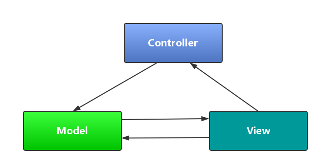

## 1. MVC设计模式
### 1.1 概述

模型-视图-控制器，MVC设计模式的目的是将数据模型和视图分离开来，并以控制器作为连接两者的桥梁以实现解耦



| 意义   | 说明                                       |
| :--- | :--------------------------------------- |
| M    | Model，表示模型层，数据模型或业务模型，就是我们要显示给用户查看的内容    |
| V    | View，表示视图层，用户界面，就是用户直接看到的界面，例如：Activity，Fragment，自定义View，还有XML布局文件 |
| C    | Controler，表示控制层，业务逻辑，用于模型和视图间切换数据，对应于Activity业务逻辑，数据处理和UI处理 |

而J2EE中的MVC分别表示：

- M：javabean
- V：jsp
- C：servlet

三角关系的问题就是维护问题。在MVC，当你有变化的时候你需要同时维护三个对象和三个交互，这显然让事情复杂化了。

使用mvc设计模式的时候，大部分的情况下 View和Controller都由activity来控制。Android中经常会出现数千行的Activity代码，究其原因，Android中纯粹作为View的各个XML视图功能太弱，Activity基本上都是View和Controller的合体，既要负责视图的显示又要加入控制逻辑，承担的功能过多，代码量大也就不足为奇。所以更贴切的目前常规的开发说应该是View-Model 模式，大部分都是通过Activity的协调，连接，和处理逻辑的

Activity中存在两部分内容：业务相关和界面相关，V中的内容较少，而C中的内容较多

解决方案：将Activity中的业务部分拆分----MVP，将Activity中的界面部分拆分----MVVM

### 1.2 案例分析
Android中的ListView就用到了MVC设计模式

- M：数据的集合，List&lt;UserInfo>
- V：ListView
- C：Adapter，控制数据如何显示在ListView上

而Activity控制层和视图层都有

数据模型，业务层，业务逻辑，数据层，表现层，控制层：事件路由

很多人表示对架构没有任何概念，想了解下架构，但是看了网上的一些文章又觉得云里雾里，其实架构远没有那么难，今天从这篇文章开始我来给大家谈谈架构，争取让大家都看得懂。

## 2. 架构浅谈之 MVC

> 原文链接：@薄荷科技主管 张帅 http://mp.weixin.qq.com/s/GuO5wdo2rJgvHH6mErLgqw

### 2.1 什么是架构？

对于架构，业界从来没有一个统一的定义，架构一词最初来自建筑业，假如我们要盖一栋大楼，那在完成这么一项重大工程之前肯定需要建造师的建筑图纸，而这建筑图纸可以说是建筑业架构的最核心体现，它描述了这栋大楼的外观、内部构造、户型设计、材料做法以及设备、施工等，有了建筑图纸，才能整体的规划整个工程，从大局出发，有序的推进项目的发展，最大程度的提高生产力。

所以归根结底，架构的目的就是为了提高生产力。而软件领域的架构主要体现在模块之间的「高内聚，低耦合」，这六个字听起来有点难以理解，其实通俗来讲就是单一职责的功能封装成模块，在模块内部高度聚合，模块与模块之间不会互相依赖，即低耦合。比如我们常用的网络库、图片加载库，这都是属于两个模块，在每个模块内部功能单一，代码高度内聚，但是网络库与图片加载库又不互相依赖，都可以独立工作，互不干扰，这就是所谓的低耦合。

而我们追求「高内聚，低耦合」的目的很简单，我们想让开发人员只专注于一点，提高开发效率的同时，也对代码的健壮性与扩展性有很大好处。试想，如果你做的功能需要同时跟四个部门进行合作，依赖于他们的模块，那么你的开发效率肯定奇低，而且依赖过高，其他部门的代码稍一改动很可能就会对你产生影响，而且问题还不容易定位，这将是一个定时炸弹。

所以，架构的重要性不言而喻，但是架构有一条原则：千万不要过度设计！

如果你盖的是栋大楼，你肯定需要建造师的建筑图纸，但是如果你盖的是一间茅草屋，你觉得你还需要请个建造师来先给你设计一张建筑图纸再开工么？可能花在设计建筑图纸的时间都够你盖完了。所以架构一定得看不同场景的需求，如果你的工程总共就十来个文件，那么你在开发的过程中运用各种设计模式、考虑各种分层，只会让原本简单的东西复杂化，还会增加工作量，这违背了架构的初衷。

最原始、最简单的东西反而是最高效的，只不过我们的项目慢慢变得庞大，那些最原始的框架与结构满足不了我们的需求了，这个时候我们必须从整体出发重新考虑整个项目的架构，通过架构来帮助我们提高生产力，减少重复繁杂的工作量，提升工作效率。

### 2.2 三层架构

说到架构，就不得不谈到最经典的三层架构的概念，三层架构最初是微软提出的，并且推荐各应用程序都应该遵守这种分层方式，而现今大多数应用程序基本都遵守这三层分层式架构。这三层架构分别是：**表示层、业务层、数据访问层**。


我们拿访问一个网站来举个例子。你在浏览器输入一个网址，访问一个网站的时候，这中间经过了这么一个过程，用户在浏览器输入 url，然后浏览器向 Server 发起一个 http 请求，Server 拿到这个 http 请求之后会根据相关的条件到数据库查询相关数据，然后把数据以特定的格式（网站是 html 格式）返回给浏览器，浏览器再根据特定数据渲染出相应页面。

这其中就对应了三层架构，首先对用户来说，浏览器就是表示层，它主要是与用户交互的页面，根据用户的输入与事件，处理并显示返回的特定数据。我们知道数据是一切应用程序的基础，如果没有数据，那么没有任何意义，所以 Server 端必须要一个强大的数据库来存储所有用户交互产生的数据，而对这些数据的处理，包括增、删、改、查就属于数据访问层。那么连接表示层与数据访问层的就是业务逻辑层，这包括后端程序中模型设计、验证、业务规则、各种计算等。

所以后端的架构是很复杂的，它除了有复杂的业务逻辑之外，还有存储、性能、并发、负载均衡等等，所以架构师一职最初也是针对服务端提供的职位。

### 2.3 MVC

随着移动端的普及，手机端的应用程序功能越来越大，项目也越来越复杂，所以移动端架构也被越来越多的人关注与重视，但是移动端架构远没有服务端复杂，一是移动端的数据来源于服务端，不必有专门的数据存储，最多有本地的缓存以及一些必要的小型数据库，对于一些复杂的业务逻辑也更多的放在服务端，而且客户端不必考虑成百上千万用户的同时访问，移动端通常更应该把精力专注在 UI、交互、体验上，所以客户端的架构没有那么重，但是为了让移动端代码分层更加清晰，代码扩展性更好，以及更好的高内聚、低耦合，目前有一系列的移动端架构方案，大家耳熟能详的比如 MVC、MVP、MVVM、Clean 等，今天就先来针对 Android 开发，来讲讲 MVC 的概念。

MVC 是 Model（模型）、View（视图）、Controller（控制器） 的缩写，其中 View 层处理界面显示，Controller 层用来处理用户的交互与事件，Model 层则用来定义实体对象与处理业务逻辑。

这么说难免有点晦涩难懂，我们来拿我们最熟悉的 Android 开发来举例。

### 2.4 Android MVC

其实 Android 开发本身默认的就是一套 MVC 实现。

**View 层**：Android 开发中的 xml 布局就是我们的 View 层，默认情况下也建议 View 都尽量用 xml 实现，当然对于一些复杂的就需要我们自定义 View 了，自定义 View 同样也是属于 View 层，只不过大多数时候还是 xml 布局用的最多；

**Controller 层**：毫无疑问，Android 默认也给我们提供了 Controller，就是 Activity & Fragment，仔细想想，是不是用户的交互事件，如输入、点击、滑动等都是在 Activity、Fragment 中处理的？关于这点有人认为 Activity & Fragment 属于 View 层，这个我是不认可的，View 应该专注界面的显示，Controller 处理用户的交互，提供给 View 需要的数据，从而让 View 正确的显示出来，而这都是 Activity & Fragment 的工作。

**Model 层**：Android 中对 View 与 Controller 有了定义，其实没有对 Model 层做定义，而大部分架构都不会对 Model 层做定义，因为 Model 本身是跟业务相关，针对不同的业务模型，定义需要的数据模型与实体类，以及相关的业务逻辑处理，虽然 Android 没有明确定义 Model 层，但是我们在开发中都会定义一个专门的 model  package 用来统一管理所有的 model 文件，如 User、Order、Chat 等。

这里做个补充，因为对于部分初学者可能不理解什么是 Model，Model 的具体职责以及什么是所谓的业务逻辑？这里姑且说明下：

1.Model 即模型，也就是数据模型，通常就是所谓的 JavaBean 实体类，比如在界面上我们要显示一些用户信息，这个时候我们必须定义一个 User 对象，这个 User 对象也即所谓的 Model，如
```java
public class User {
    private int age;
    private String name;
    private ...

    public void setAge(int age) {
    }

    public int getAge() {
        return age;
    }
    ...
}
```
通常这个就是 Model 的主要功能。

2.Model 就是一个数据模型的定义，定义了供我们使用的数据实体类而已。因为大部分我们的数据来源都是来自后端，客户端不需要处理太多的业务逻辑，所以大部分情况下 Model 也就只包含基本的属性与 get、set 方法。但是，并不是说明客户端不包含任何业务逻辑，比如我们除了显示用户的基本信息外还需要显示用户的身体质量指数（也就是 BMI），这个值不是一个 Model 自带的属性，而是根据一些属性通过一定的算法算出来的，这也就是所谓的业务逻辑。

BMI 的算法很简单，就是体重（kg）÷ （身高^2（m）），有人可能直接在显示的页面把这段算法写出来，比如直接在 Activity 有如下代码：

> textView.setText(String.valueOf(user.weight / (user.height * user.height)));

这个当然是可以，但是很糟糕，因为你需要在每一个显示的地方都写这么一段代码，而它本身是属于业务逻辑的，所以你应该把这个算法放在 User 的 model 里处理：
```java
public class User {
    private int age;
    private String name;
    private float weight;
    private float height;
    ...
    ...
    public float getBMI() {
        return weight / height * height;
    }
}
```
然后只需要在需要显示的地方调用 user.getBMI() 这个方法就 ok 了，这个算法其实就是所谓的简单的业务逻辑。

当然以上只是举个例子，其实很简单的概念，但是对于一些初学者可能不能理解，特此说明下，实际开发过程中，所有跟 model 相关的一些计算都可以算作业务逻辑，而这也是 Model 的第二个重要作用。

### 2.5 MVC 与三层架构的关系

有人可能会问了，你一会三层架构，一会 MVC 的，他俩之间到底是什么关系？

三层架构是一种软件领域最普遍的分层式架构，而 MVC 是在三层架构的基础上设计的一种框架型架构，三层架构是一种宏观的概念，而 MVC 就是一种比较具体的三层架构的框架实现，我们在 MVC 的基础上把不同类别的代码文件进行分类就可以了，所以他们之间的关系可以用下图来表示：


上图可以看到，View 层和 Controller 层都属于三层架构的表示层，而 Model 层属于业务层，有人又问了，那数据访问层怎么没有相对应的呢？这个就是有争议的地方了。

有人认为 Model 层除了定义业务需要的实体类与简单的逻辑算法处理之外，还应该包括对数据库的操作、对网络等的操作等，这对后端开发来说没问题，因为后端的数据全部来源于数据库，而且后端可以很方便的跟数据服务器进行连接，而 Model 的业务逻辑大多都是来自对数据的处理，所以这种方式很正常。

但是对于客户端来说差别就大了，我们知道客户端的数据来源大多来自服务端的接口请求，但是很可能同时有本地数据库、本地的文件都能提供数据，比如可能会有离线操作，比如可能为了用户体验，用户断网的时候会做缓存处理，也就是说客户端的数据来源有多种多样，而 Model 本身的主要职责应该定义业务需要的数据模型以及简单的逻辑处理，如果同时也要处理本地数据库与网络数据未免变得臃肿起来，而且职责不清晰。

所以，我是非常不建议在 Model 层做多余的数据处理工作的，而对应三层架构我强烈建议客户端的开发中应该多一层 data 层，也就是所谓的数据处理层，这一层包含了对 database、network、sharedpreference 等数据的处理，Model 层回归最简单、最本质的模型职责，只定义业务需要的数据模型与简单的逻辑处理即可。

### 2.6 MVC 的优缺点

虽然 Android 开发框架并不是严格意义上的 MVC，但是显而易见，默认的开发就是 MVC 框架，优点也很明显，学习成本很低，理解很容易，对 UI 层与业务层做了分离，我们只需要对 Model 层与 data 层做个简单的分层与封装，就是一个扩展性还不错、还算清晰的开发架构。

但是缺点也很明显，随着功能的不断迭代与越来越复杂的交互处理，Controller 层也就是 Activity、Fragment 中的代码越来越多，变得很臃肿，难以维护，尤其在需求变化的时候，改起来特别痛苦，我甚至见过一个 Activity 有几千行代码的情况，试想这得多痛苦，当然出现这种情况本身也有程序员自己的问题，但是这暴露了 MVC 这种架构的缺点。

MVC 可以说是最经典的架构模式，它适用于大部分的开发场景，如果你对架构不怎么了解，那么建议老老实实的使用 MVC，在此架构基础上进行封装与优化绝对够了，只是项目到了一定体量了，需求也越来越复杂，总归是会碰到难以扩展、Controller 层发展成“死胖子”的情况，这个时候怎么解决呢？且听下回分解，当然下篇什么时候我也不清楚。