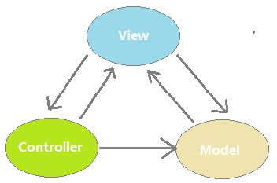

## MVVM设计模式

| 意义        | 说明                                       |
| :-------- | :--------------------------------------- |
| Model     | 实体模型，代表基本业务逻辑                            |
| View      | 对应于Activity和xml，负责View的绘制以及与用户交互         |
| ViewModel | 将view和model联系在一起，起到桥梁的作用，负责完成View于Model间的交互,负责业务逻辑 |

MVVM的目标和思想MVP类似，利用数据绑定(Data Binding)、依赖属性(Dependency Property)、命令(Command)、路由事件(Routed Event)等新特性，打造了一个更加灵活高效的架构。

ViewModel大致上就是MVP的Presenter和MVC的Controller了，而View和ViewModel间没有了MVP的界面接口，而是直接交互，用数据“绑定”的形式让数据更新的事件不需要开发人员手动去编写特殊用例，而是自动地双向同步。比起MVP，MVVM不仅简化了业务与界面的依赖关系，还优化了数据频繁更新的解决方案，甚至可以说提供了一种有效的解决模式。

可以直接在layout布局xml中绑定数据，分离视图与业务逻辑，低耦合，可重用，独立开发，可测试

View和Model进行双向绑定（data binding），View的变化可以自动的反应在ViewModel，ViewModel的数据变化也会自动反应到View上，data binding框架解决了数据绑定的问题

- 数据驱动

在MVVM中，以前开发模式中必须先处理业务数据，然后根据的数据变化，去获取UI的引用然后更新UI，也是通过UI来获取用户输入，而在MVVM中，数据和业务逻辑处于一个独立的View Model中，ViewModel只要关注数据和业务逻辑，不需要和UI或者控件打交道。由数据自动去驱动UI去自动更新UI，UI的改变又同时自动反馈到数据，数据成为主导因素，这样使得在业务逻辑处理只要关心数据，方便而且简单很多。

- 低耦合度

MVVM模式中，数据是独立于UI的，ViewModel只负责处理和提供数据，UI想怎么处理数据都由UI自己决定，ViewModel 不涉及任何和UI相关的事也不持有UI控件的引用，即使控件改变（TextView 换成 EditText）ViewModel 几乎不需要更改任何代码，专注自己的数据处理就可以了，如果是MVP遇到UI更改，就可能需要改变获取UI的方式，改变更新UI的接口，改变从UI上获取输入的代码，可能还需要更改访问UI对象的属性代码等等。

- 更新 UI

在MVVM中，我们可以在工作线程中直接修改View Model的数据（只要数据是线程安全的），剩下的数据绑定框架帮你搞定，很多事情都不需要你去关心。

- 团队协作

MVVM的分工是非常明显的，由于View和View Model之间是松散耦合的。一个是处理业务和数据，一个是专门的UI处理。完全有两个人分工来做，一个做UI（xml 和 Activity）一个写ViewModel，效率更高。

- 可复用性

一个View Model复用到多个View中，同样的一份数据，用不同的UI去做展示，对于版本迭代频繁的UI改动，只要更换View层就行，对于如果想在UI上的做AbTest 更是方便的多。

- 单元测试

View Model里面是数据和业务逻辑，View中关注的是UI，这样的做测试是很方便的，完全没有彼此的依赖，不管是UI的单元测试还是业务逻辑的单元测试，都是低耦合的。

通过上面对MVVM的简述和其他两种模式的对比，我们发现MVVM对比MVC和MVP来说还是存在比较大的优势，虽然目前Android开发中可能真正在使用MVVM的很少.

通过一系列的学习，消化和参考。目前，MVC，MVP都已经应用到项目开发中了。
关于MVVM目前是只闻其声，不见其下楼。MVVM算是舶来品，从Web前端的Argular而来。Argular有个databind的属性领我们羡慕不已，瞬间感觉高大上啊！

其实，还有WPF，这个落寞巨人微软的背影。这个有个点感觉很牛逼就是，界面开发和业务开发完全分开实现。界面开发除了数据是假的，业务操作绑定，显示全是真的，业务流程的定义和界面设计进行了解耦，二者通过接口文档，默认命名规则进行约定实现。最后界面显示和业务处理拼合起来就好了。

我觉得除了databind （现在有robobinding可以参考），还需要 有事件订阅与发布 的模块（推荐使用使用facebook的flux），相关技术用到RxJava，RxAndroid的模块。

而后再加上代码自动生成，通过web服务器的数据库，直接生成业务处理代码与接口，Android端也自动生成业务处理类。着多牛逼啊，然后Android开发失业。web开发失业。数据库设计和界面开发笑到了最后。

这都是我们对于mvvm的自嗨和幻想+YY，Google大兄弟目前还没有推荐的技术实现。感觉Google处境很尴尬，现在Facebook 推出的 React Native 如日中天，大有替代Java 原生编程的趋势。如果真取代了，Android Application 将是 Node.js JavaScript的乐园。我们原生应用的开发工程师可要下岗了。目前已经在不断蚕食Android原生开发的份额，通过Cordova这个内奸，Html5家族由原来的jQuery Mobile 到 Augular.js 和ionic，再到 React 和 React Native，来势汹汹。JS是如日中天，蓬勃发展。再回来讨论MVVM竟然是前端带来的技术。遇见的未来竞争会更激烈。广大Android原生开发的从业者受的的冲击会更大。

## MVC特点

- 用户可以向View发送指令， 再由View直接要求Model改变状态
- 用户也可以直接向Controller发送指令，再由Controller发送给View
- Controller起到事件路由的作用，同时业务逻辑也都部署在Controller中

## MVVM的特点

MVVM与MVP非常相似，唯一的区别是View和Model进行双向绑定（data binding），两者之间有一方发生变化则会反应到零一方上。而MVP与MVVM的主要区别是，MVP中的View更新需要通过Presenter，而MVVM则不需要，因为View和Model进行双向绑定，数据的修改会直接反应到View上，而View的修改也会导致数据的变更。此时，ViewModel需要做的只是业务逻辑的处理，以及修改修改View和Model的状态。MVVM模式有点像ListView和Adapter、数据集的关系，这个Adapter就是ViewModel的角色，它与View进行了绑定，又与数据集进行了绑定，当数据集合发生变化时，调用Adapter的notifyDataSetChange()之后View就直接更新了，它们直接没有直接的耦合，使得ListView变得更为灵活。

